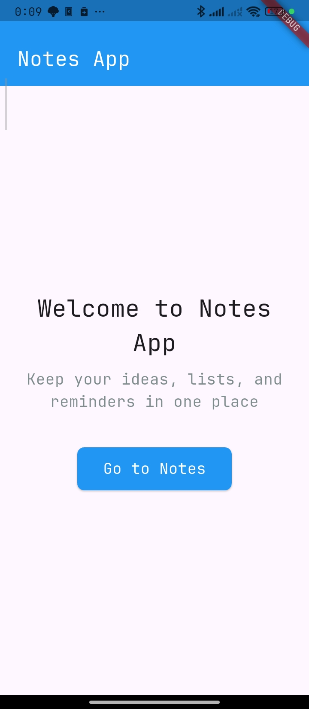
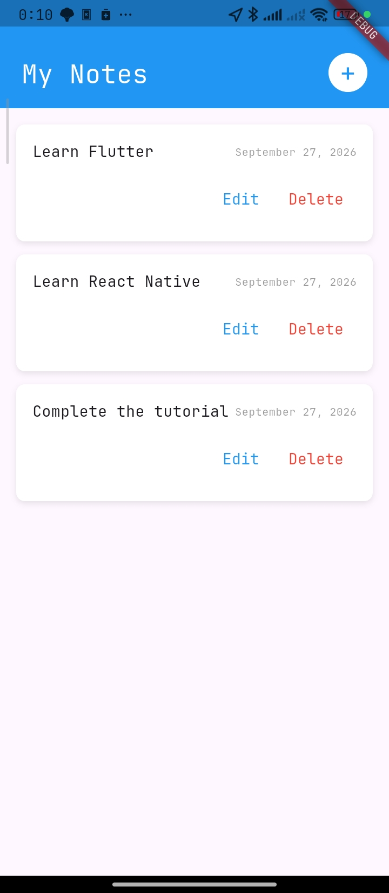

# Notes App

A cross-platform Flutter application for creating, editing, and deleting short text notes with a clean Material design and a two-screen navigation flow.

## Overview

Notes App is a lightweight Flutter project built to demonstrate a small but complete CRUD workflow across multiple screens. The app opens on a welcome screen and navigates to a notes screen where records can be created, modified, and removed through focused dialogs.

Notes are held in memory for the lifetime of the session and are pre-seeded with three sample entries, so the list is populated on first launch and the empty state appears only after every note has been removed.

## Features

- **Welcome screen** with a branded header, introductory copy, and a call-to-action button that routes to the notes screen.
- **Create notes** through a dialog containing a multi-line, auto-focused text field; empty input is rejected.
- **Edit notes** in place, reusing the same dialog in an "Edit Note" mode.
- **Delete notes** behind a confirmation dialog that warns the action cannot be undone.
- **Timestamped records** — every note displays a creation date formatted with `intl`; edited notes also receive an `updatedAt` value.
- **Newest-first ordering** — newly created notes are inserted at the top of the list.
- **Empty state** — a "No notes yet. Create one!" message is shown when the list is empty.
- **Reusable widgets** — the list row, input dialog, and delete dialog are extracted as standalone components that receive their data and callbacks from the parent.

## Screenshots

| Home | Notes |
| --- | --- |
|  |  |
| Welcome screen with the blue header, introductory copy, and the "Go to Notes" action. | The notes list with the `+` button; each entry shows its content, creation date, and Edit/Delete actions. |

## Project Structure

```text
notes_app/
├── lib/
│   ├── main.dart                  # App entry point, MaterialApp, theme, named routes
│   ├── screens/
│   │   ├── home_screen.dart       # Welcome screen ('/')
│   │   └── notes_screen.dart      # Notes list and all CRUD state (StatefulWidget)
│   └── components/
│       ├── note_item.dart         # List row: content, timestamp, edit/delete actions
│       ├── note_input_dialog.dart # Add/edit dialog with text field
│       └── note_delete_dialog.dart# Delete confirmation dialog
├── test/
│   └── widget_test.dart
├── docs/
│   └── screenshots/               # Images used in the Screenshots section
├── android/  ios/  linux/  macos/  web/  windows/   # Platform runners
├── analysis_options.yaml          # flutter_lints + analyzer excludes
└── pubspec.yaml
```

## Architecture

The project follows a small layered widget structure with no external state-management solution.

- **Entry point** — `main.dart` configures a single `MaterialApp` with a `deepOrange` primary swatch and two named routes: `/` (`HomeScreen`) and `/notes` (`NotesScreen`). Navigation between them uses `Navigator.pushNamed`.
- **Presentation layer** — `HomeScreen` is stateless. `NotesScreen` is a `StatefulWidget` that owns the entire note collection, a `TextEditingController`, and the current editing target, rebuilding via `setState`.
- **Component layer** — files under `lib/components/` are stateless widgets that receive their data and behaviour through constructor parameters (`note`, `onEdit`, `onDelete`, `onSave`) and delegate all state changes back to `NotesScreen`.
- **Data model** — a note is a `Map<String, dynamic>` with the keys `id`, `content`, `createdAt`, and optionally `updatedAt`.

Because the model is held in widget state, data does not survive an app restart.

## Dependencies

| Package | Version | Purpose |
| --- | --- | --- |
| `flutter` | SDK | Framework |
| `cupertino_icons` | `^1.0.8` | Cupertino icon font |
| `intl` | `^0.20.3` | Date formatting (`DateFormat.yMMMMd('en_US')`) |

Dev dependencies: `flutter_test` (SDK) and `flutter_lints` `^6.0.0`.

There are no networking, storage, or state-management packages — the app runs entirely on the Flutter SDK plus `intl`.

## Getting Started

### Prerequisites

- [Flutter](https://docs.flutter.dev/get-started/install) on the stable channel
- Dart SDK `^3.13.4` (bundled with Flutter)
- A platform toolchain for your target: Android Studio (Android), Xcode (iOS/macOS), or the build tools for Linux/Windows desktop

### Installation

```bash
cd notes_app
flutter pub get
```

### Running the Project

```bash
flutter run                 # run on the connected/default device
flutter run -d chrome       # run on the web
flutter devices             # list available targets
```

### Building the Project

```bash
flutter build apk            # Android
flutter build appbundle      # Android App Bundle
flutter build ipa            # iOS (requires macOS + signing)
flutter build web            # Web
flutter build linux          # Linux desktop
flutter build macos          # macOS desktop
flutter build windows        # Windows desktop
```

Release artifacts are written to `build/`.

## Configuration

- **Version** — declared as `1.0.0+1` in `pubspec.yaml`.
- **Theme** — `primarySwatch: Colors.deepOrange` in `main.dart`; screens supply their own blue header styling.
- **App title** — `Notes App`, set via `MaterialApp.title`.
- **Lints** — `analysis_options.yaml` includes `package:flutter_lints/flutter.yaml` and excludes the `build/` and platform runner directories from analysis.
- **Assets and fonts** — none are declared; the app relies on Material icons only.

## Supported Platforms

The standard Flutter platform runners are present and configured for all six desktop and mobile targets: **Android, iOS, Linux, macOS, Web, and Windows**. Code is pure Flutter with no platform-specific APIs, so no platform-specific setup is required beyond the normal toolchain for each target.

## Development Notes

- Run `flutter analyze` to check for issues against the configured lint set.
- `test/widget_test.dart` is still the unmodified Flutter counter template and does not exercise this app; it will fail as written. Replace it with tests covering `HomeScreen` and `NotesScreen`.
- Notes exist only in `NotesScreenState`; restarting the app resets the list to the three seeded sample notes.
- `NotesScreen.dispose` releases the `TextEditingController` — keep that behaviour intact when refactoring the state class.

## Resources

- [Flutter documentation](https://docs.flutter.dev/)
- [Flutter learning resources](https://docs.flutter.dev/reference/learning-resources)
- [`intl` on pub.dev](https://pub.dev/packages/intl)
